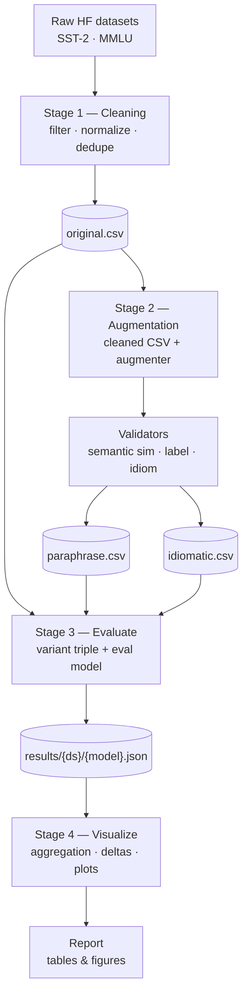

# Architecture — Idiom Degradation Project

This document describes the module structure, data flow, and interfaces of the
project. It complements [README.md](README.md), which covers motivation, scope,
datasets, models, and milestones.

The architecture is **modular**: cleaning, augmentation, evaluation, and
analysis are decoupled and communicate through versioned files on disk plus
YAML configs, so any stage can be re-run independently.

## 1. System Overview

The pipeline is a sequence of four explicit stages, each runnable in
isolation and communicating only through files on disk. Stage 4 is a
cross-run step that aggregates results and produces tables and figures.



Key points:

- **Stage 1** is dataset-specific and idiom-agnostic; its only job is to
  produce a clean CSV of task rows suitable for downstream rephrasing.
- **Stage 2** takes a cleaned CSV plus an augmenter model id and emits the
  two augmented CSVs. Because `id` and `y` are preserved, the three CSVs form
  an aligned **variant triple**.
- **Stage 3** takes a variant triple plus an evaluated model id and runs the
  same task prompt on all three CSVs, joining per-example predictions by `id`
  for paired comparisons.
- **Stage 4** reads Stage 3 result files (across models / datasets), computes
  per-variant deltas and significance, and emits comparison tables and Plotly
  figures. It touches no model or dataset, so it is re-runnable on its own.
- Every artifact (cleaned row, augmented row, result file) records the
  config hash and model / prompt versions that produced it.

## 2. Module Breakdown

### 2.1 `data/` — raw dataset loaders

**Responsibilities**

- Load raw datasets from Hugging Face (`sst2`, `mmlu`).
- Normalize into a shared in-memory schema (`DatasetRow` = `id`, `x`, `y`,
  `meta`).
- Provide deterministic loading and caching.
- Expose each dataset through a **registry** so new datasets can be added
  without touching any other module.

This module is a thin wrapper around HF `datasets`; it performs no filtering
or cleaning — that belongs to Stage 1 (`cleaning/`). All datasets are loaded
from Hugging Face; non-HF sources are not supported in the current phase.

**Registry**

```python
# data/registry.py
DATASETS: dict[str, type[DatasetLoader]] = {}

def register_dataset(name: str) -> Callable[[type[DatasetLoader]], type[DatasetLoader]]:
    ...  # populates DATASETS
```

**Interface**

```python
class DatasetLoader(Protocol):
    name: str
    def load(self) -> Iterable[DatasetRow]: ...
```

### 2.2 `cleaning/` — Stage 1: filter & normalize → cleaned CSV

**Responsibilities**

- Consume the raw examples from `data/` and emit a single CSV per dataset
  containing the rows to be rephrased and idiomatized.
- Filter rules configured per dataset:
  - **length band** — drop rows whose input token / word count falls outside
    `[min_len, max_len]`; short rows leave no room for idioms, long rows are
    expensive and dilute the effect;
  - **text normalization** — strip markup, control characters, URLs;
    normalize whitespace and quoting;
  - **deduplication** — remove duplicate `x` (after normalization);
  - **shuffle** with a fixed seed;
  - **row cap** — optional `max_rows` per split for compute budget.
- Assign a stable `id` to every retained row (source id when available, else
  a hash of the normalized `x`).
- Preserve `y` and dataset-specific `meta` (e.g. MMLU choices / subject).

**Output**

`datasets_out/{dataset}/original.csv` — the canonical Stage 1 artifact.

**Interface**

```python
class Cleaner(Protocol):
    dataset: str
    def clean(self, examples: Iterable[DatasetRow]) -> Iterable[DatasetRow]: ...
    # writes datasets_out/{dataset}_original.csv
```

### 2.3 `augmentation/` — Stage 2: cleaned CSV → paraphrase + idiomatic

**Responsibilities**

- Take **(cleaned CSV path, augmenter model id)** as inputs and emit two
  aligned CSVs — one paraphrased (no idioms), one idiomatic.
- Two augmentation strategies wrapping the same external LLM client:
  - `ParaphraseAugmenter` — reword `x` **without** idioms.
  - `IdiomaticAugmenter` — reword `x` **with** idioms.
- Three registered provider clients behind a common `LLMClient` seam —
  `gemini` (default), `anthropic` (Claude), `openai` (GPT) — selected purely
  via config (`augmenter` + `augmenter_model`). API keys are read from env
  only (`GEMINI_API_KEY` / `ANTHROPIC_API_KEY` / `OPENAI_API_KEY`) and never
  persisted. The augmenter runs a dedicated external-API code path separate
  from the HF-based `models/` registry — it must be strictly stronger than
  the models under evaluation, which HF-hosted open weights do not satisfy
  for our purposes today.
- Batching, retries, rate limiting, and an on-disk **response cache** keyed by
  `(prompt_hash, augmenter_model, input_id)`.
- Validators applied to every augmented row — `label_preservation`,
  `idiom_presence`, and `idiom_absence` are real LLM judges that reuse the
  augmenter's provider + model; `semantic_similarity` is a deferred
  always-pass stub (embeddings are future work, §13-equivalent):
  - **Semantic similarity** filter (embedding cosine ≥ threshold) — *stub,
    always passes for now*;
  - **Label preservation** check (LLM judge);
  - **Idiom presence / absence** check for the correct variant (LLM judge).
- **Failure policy:** a failing, empty, or refused row triggers up to N
  retries (default 3, exponential backoff); if it still fails, the pipeline
  **raises and aborts the whole dataset run** — no partial/bad rows are
  written, preserving row alignment across variants.
- Preserve `id`, `y`, `split`, and `meta` from the cleaned CSV so all three
  variants are row-for-row aligned.
- Expose augmenters through a **registry** so new provider clients can be
  plugged in without touching Stage 2 orchestration.

**Outputs**

- `datasets_out/{dataset}/paraphrase.csv`
- `datasets_out/{dataset}/idiomatic.csv`

**Registry**

```python
# augmentation/registry.py
AUGMENTERS: dict[str, type[Augmenter]] = {}

def register_augmenter(name: str) -> Callable[[type[Augmenter]], type[Augmenter]]:
    ...
```

**Interface**

```python
class Augmenter(Protocol):
    variant: Variant
    augmenter_model: str
    def __init__(self, *, variant: Variant, prompt_hash: str) -> None: ...
    def augment(self, ex: DatasetRow) -> AugmentedRow: ...

class Validator(Protocol):
    def validate(self, ex: AugmentedRow) -> ValidationResult: ...
```

Stage 2 is orchestrated by `AugmentPipeline` (no `run_stage2` free function —
inlined into the class, the same pattern used for Stage 3 in §2.6):

```python
class AugmentPipeline:
    def __init__(self, cfg: AugmentConfig, input_csv: Path, out_dir: Path, config_path: Path) -> None: ...
    def run(self) -> tuple[Path, Path]:
        """Returns (paraphrase_csv_path, idiomatic_csv_path)."""
```

Driven by the `idiom-augment` CLI (`scripts/augment.py`), which is
config-driven via `configs/augment/{dataset}.yaml` — `--config` for a single
dataset, `--all` to run every registered dataset (each requires its own
`configs/augment/{dataset}.yaml`).

### 2.4 `datasets_out/` — persisted stage artifacts

- One CSV per (dataset, variant):
  - `datasets_out/{dataset}/original.csv`   ← Stage 1 output
  - `datasets_out/{dataset}/paraphrase.csv` ← Stage 2 output
  - `datasets_out/{dataset}/idiomatic.csv`  ← Stage 2 output
- All three files share the row schema in §3 and are aligned by `id`.
- Versioning is handled via an optional `_v{n}` suffix when a dataset is
  regenerated (e.g. `sst2_paraphrase_v2.csv`); the active version per
  experiment is pinned in the experiment config. *(Future work; not yet
  implemented — Stage 2 always writes the unversioned `paraphrase.csv` /
  `idiomatic.csv`.)*

### 2.5 `models/` — model registry & runners

**Responsibilities**

- A **registry** mapping model IDs (e.g. `qwen3.5-7b-instruct`) to loader
  factories. Adding a new model is a single file + `@register_model(...)`
  decorator with **no changes** to runners or Stage 3 code.
- One runner implementing the `Model` interface, consumed by Stage 3:
  - `DecoderRunner` — loads an instruction-tuned decoder from Hugging Face
    and runs inference with dataset-specific prompt templates.
- **HF only.** All model loaders go through `transformers` /
  `huggingface_hub`. Non-HF models are not supported in the current phase.
- **GPU-aware** (README §9.4): every runner obtains its compute device from
  `models.device.select_device()` and honors it for model placement, batch
  placement, and precision. No hard-coded `"cuda"`.

**Registry & device helper**

```python
# models/registry.py
MODELS: dict[str, ModelSpec] = {}

def register_model(name: str, *,
                   default_precision: Literal["fp32", "fp16", "bf16"] = "bf16",
                   ) -> Callable[[type[Model]], type[Model]]:
    ...

# models/device.py
def select_device() -> torch.device:
    """Return cuda if available, else mps if available, else cpu."""
```

**Interface**

```python
class Model(Protocol):
    id: str
    device: torch.device
    def predict(self, batch: list[FormattedInput]) -> list[Prediction]: ...
```

### 2.6 `eval/` — Stage 3: run one model on a variant triple

**Responsibilities**

- Take **(dataset name, evaluated model id)** as inputs; internally locate
  the three CSVs `datasets_out/{dataset}/{original,paraphrase,idiomatic}.csv`
  and run inference on all three with the **same** dataset-specific prompt
  and instructions — only `x` changes between the three runs.
- One prompt formatter per dataset (SST-2, MMLU); same formatter is applied
  to all three variants of that dataset.
- Metric functions matching each dataset's original paper.
- Batched evaluation loop that yields per-example predictions and per-run
  aggregate metrics.
- After the three runs, **join by `id`** to produce paired per-task rows:
  `{id, y, pred_original, pred_paraphrase, pred_idiomatic, correct_*}` — the
  raw material for downstream paired significance tests.
- Consumes models via the `Model` interface (§2.5); in the current phase
  the only wired runner is `DecoderRunner`.

**Interface**

```python
class Evaluator:
    dataset: str
    metric: Callable[[list[Prediction], list[Label]], dict]
    def format(self, ex: AugmentedExample, variant: str) -> FormattedInput: ...
    def run_variant(self, model: Model, variant_csv: Path) -> RunResult: ...

def run_stage3(dataset: str, model_id: str) -> Path:
    """Runs the model on all three variants and returns the result JSON path."""
```

### 2.7 `analysis/` — Stage 4: aggregation, statistics & visualization

**Responsibilities**

- Join per-run results across (model × dataset × variant).
- Compute Δ<sub>paraphrase</sub>, Δ<sub>idiom</sub> per (model, dataset), each
  with a paired-bootstrap confidence interval and a two-sided p-value.
- `aggregate()` returns one row per (dataset, model) as a `pandas.DataFrame`.
- Generate summary tables (CSV / Markdown) and **Plotly** figures, driven by
  **three flags-only CLIs** (no `--config` file; bootstrap params —
  `--n-resamples`, `--ci`, `--seed` — are plain CLI flags):
  - `idiom-analyze` — cross-run summary table only, **no figures**.
  - `idiom-plot-dataset` — per-dataset cross-model figure + companion table
    (supports `--all` to run every dataset with a `results/{dataset}/`
    folder).
  - `idiom-plot-summary` — cross-dataset summary figure + companion table.
- Reads **Stage 3 result files only** (`results/{dataset}/{model}.json`), so
  it is independently re-runnable without touching any earlier stage.
- **Fails loudly** if a model's result set is missing any of the three
  variants, so every chart/table always reflects a complete triple.

**Significance**

- Delta point estimate + percentile **confidence interval** from a paired
  bootstrap over each example's `correct` boolean (`scipy.stats.bootstrap` with
  `paired=True` over a single vector statistic, so one shared set of resampled
  indices drives the per-variant accuracy CIs and the delta CIs alike).
- Delta **p-value**: McNemar's exact two-sided test on the discordant pairs,
  via `scipy.stats.binomtest(min(b, c), b + c, 0.5)` — the standard
  significance test for paired binary (correct/incorrect) outcomes. When there
  are no discordant pairs (e.g. the identity phase) the p-value is `1.0`.

**Per-dataset cross-model visualisation** (`idiom-plot-dataset`)

- **Input:** a dataset name (or `--all`); scans `results/{dataset}/*.json`
  and loads all matching model results.
- **Output:** `analysis/figures/{dataset}_cross_model.html` — an interactive
  Plotly figure with:
  - one grouped bar per model, showing accuracy on all three variants
    (`original`, `paraphrase`, `idiomatic`) side by side, each with a
    bootstrap-CI error bar;
  - overlaid Δ<sub>paraphrase</sub> and Δ<sub>idiom</sub> annotations per
    model;
  - hover text listing `model_revision` and `config_hash` for traceability.
- Also emits a companion table
  `analysis/tables/{dataset}_cross_model.{csv,md}` (+ `.meta.json` sidecar)
  with one row per model and columns for each variant's accuracy, both
  deltas, and their CIs / p-values.

**Cross-dataset summary visualisation** (`idiom-plot-summary`)

- **Input:** every dataset under `results/`.
- **Output:** `analysis/figures/cross_dataset_summary.html` — a grouped
  delta-bar Plotly figure comparing Δ<sub>paraphrase</sub> and
  Δ<sub>idiom</sub> across every (dataset, model) pair, for a bird's-eye view
  of the central question.
- Companion table `analysis/tables/cross_dataset_summary.{csv,md}`
  (+ `.meta.json`).

**Provenance.** Every table is written with a sidecar `{name}.meta.json`
recording tool versions, a UTC timestamp, the bootstrap params
(`n_resamples`, `ci`, `seed`), and the `config_hash` / `model_revision` /
`prompt_hash` / `dataset` of every source result file that fed the table.

**Visualisation rule.** All charts, tables, and dashboards use **Plotly**
(`plotly.express` / `plotly.graph_objects`) — matplotlib / seaborn are
banned in this repo (see README §9.6). A ruff rule blocks `import matplotlib`
and `import seaborn`. Figures are **HTML only for this phase** — static
`.png` export (via `plotly` + `kaleido`) is deferred to future work
(README §13).

**Interface**

```python
def aggregate(
    results_dir: Path, *, n_resamples: int, ci: float, seed: int
) -> pd.DataFrame:
    """One row per (dataset, model): per-variant accuracy, both deltas,
    delta confidence intervals, and delta p-values."""

def plot_dataset_cross_model(
    dataset: str, results_dir: Path, *, n_resamples: int, ci: float, seed: int
) -> Path:
    """Build the per-dataset cross-model Plotly figure (HTML) covering all
    three variants for every model with a result file for `dataset`."""

def plot_cross_dataset_summary(
    results_dir: Path, *, n_resamples: int, ci: float, seed: int
) -> Path:
    """Build the cross-dataset grouped delta-bar Plotly figure (HTML) across
    every (dataset, model) pair."""
```

### 2.8 `configs/` — experiment configuration

- One YAML per stage / experiment:
  - `configs/clean/{dataset}.yaml`      — Stage 1 (length band, caps, seed)
  - `configs/augment/{dataset}.yaml`    — Stage 2 (augmenter model, prompts,
    validator thresholds)
  - `configs/eval/{dataset}_{model}.yaml`    — Stage 3 run config
  - Stage 4 (`analysis/`) is **flags-only** — no `configs/analysis/` YAML;
    its CLIs take bootstrap params (`--n-resamples`, `--ci`, `--seed`) and
    I/O paths directly as flags (see §2.7).
- Every config carries a seed and pins model / prompt versions.

### 2.9 `scripts/` — CLI entrypoints

One thin CLI wrapper per pipeline stage, plus analysis:

- `scripts/clean.py`         — Stage 1 (raw → cleaned CSV)
- `scripts/augment.py`       — Stage 2 (cleaned CSV + augmenter model →
  paraphrase + idiomatic CSVs)
- `scripts/eval.py`          — Stage 3 (dataset + eval model → result JSON
  covering all three variants)
- `scripts/analyze.py`       — implemented flags-only CLI (`idiom-analyze`):
  post-run aggregation across models & datasets into `analysis/tables/`
  (tables only, no figures; see §2.7)
- `scripts/plot_dataset.py`  — implemented flags-only CLI
  (`idiom-plot-dataset`): given a dataset name (or `--all`), build the
  per-dataset cross-model Plotly figure over all three variants (see §2.7)
- `scripts/plot_summary.py`  — implemented flags-only CLI
  (`idiom-plot-summary`): build the cross-dataset summary figure of grouped
  deltas across all datasets & models (see §2.7)

### 2.10 `tests/`

Unit tests for: dataset loader shape, cleaning filters and length-band edges,
augmenter prompt hashing / cache, validator thresholds, metric functions on
toy data, config parsing, and Stage 3 triple-join correctness.

## 3. Data Contract

All CSVs in `datasets_out/` share a single row schema. The three variant
files of a dataset are aligned by `id`, so a Stage 3 join produces one row
per original task with the three variant inputs and their predictions.

| Column | Type | Description |
|--------|------|-------------|
| `id` | str | Stable example id assigned in Stage 1 |
| `variant` | enum{`original`,`paraphrase`,`idiomatic`} | Which variant this row is |
| `x` | str | Input text for this variant |
| `y` | any | Label (unchanged across variants) |
| `meta` | dict / JSON | Dataset-specific fields (e.g. MMLU choices, subject) |
| `augmenter_model` | str | LLM name/version used (empty for `original`) |
| `prompt_hash` | str | Hash of the exact prompt template used (empty for `original`) |
| `validators` | dict / JSON | Per-validator scores and pass/fail flags (empty for `original`) |

Result files are laid out **per-dataset**, with one JSON file per model
inside the dataset's folder:

```
results/
├── {dataset}/
│   ├── {model_id}.json
│   ├── {model_id}.json
│   └── …
└── …
```

Example: `results/sst2/qwen3.5-7b-instruct.json`,
`results/sst2/deberta-v3-base.json`, …

Each result file shares this schema:

| Field | Description |
|-------|-------------|
| `model_id`, `model_revision` | Which model produced these predictions |
| `dataset`, `dataset_version` | Which dataset + variant-set version was evaluated |
| `config_hash` | Hash of the resolved Stage 3 config |
| `metrics` | Dict of aggregate metrics **per variant** (`original` / `paraphrase` / `idiomatic`) |
| `per_task` | List of `{id, y, pred_original, pred_paraphrase, pred_idiomatic, correct_original, correct_paraphrase, correct_idiomatic}` for paired stats |

## 4. Experiment Matrix

Each dataset has one **variant triple** produced by Stages 1–2:
`(original, paraphrase, idiomatic)`. Stage 3 evaluates one model against one
triple in a single run, so the full run set for the **current phase** is:

```
{ 2 datasets: SST-2, MMLU } × { decoder models }
```

with each run internally covering all three variants and emitting one
result file (per-variant metrics + paired per-task rows).

The analysis module joins result files across (model × dataset) to compute
the cross-model, cross-dataset delta tables.

## 5. Interfaces (summary)

```python
Cleaner.clean(Iterable[DatasetRow])    -> Iterable[DatasetRow]   # Stage 1
Augmenter.augment(Example)              -> AugmentedExample       # Stage 2
Validator.validate(AugmentedExample)    -> ValidationResult       # Stage 2
Model.predict(list[FormattedInput])     -> list[Prediction]       # decoder
Evaluator.run_variant(Model, csv)       -> RunResult              # Stage 3, one variant
run_stage3(dataset, model_id)           -> result JSON path       # Stage 3, full triple
aggregate(results_dir, *, n_resamples,
          ci, seed)                     -> pd.DataFrame           # Stage 4, one row per (dataset, model)
```

The uniform `Model` interface keeps Stage 3, metrics, and analysis code
decoupled from any specific model implementation — new decoder models plug
in via a single registry entry.

## 6. Reproducibility

- **Seeds**: every stage takes an explicit `seed` in its config.
- **Model pinning**: HF model IDs include a revision hash where applicable.
- **Prompt pinning**: prompt templates live in `augmentation/prompts/` and
  `eval/prompts/`, versioned, and their hash is recorded per row / per run.
- **Deterministic eval**: decoder inference uses `temperature=0` (or the
  minimal deterministic setting supported by the runtime).
- **Caching**: augmentation responses are cached by
  `(prompt_hash, model_version, input_id)`; re-running is idempotent.
- **Config hashing**: every result file records the hash of its resolved
  config so runs can be reproduced from configs alone.
- **Environment pinning**: `uv.lock` and `.python-version` are committed;
  `uv sync` reproduces the exact env on any machine.

## 7. Engineering Conventions (summary)

The authoritative statement of engineering standards lives in
[README.md](README.md) §9. Points that shape module design:

| Concern | Rule | Consequence in this doc |
|---------|------|-------------------------|
| Packaging / env | `uv` only, `uv.lock` committed | Scripts prefixed with `uv run` |
| Typing | pyright `strict` | Every module exposes typed Protocols / dataclasses |
| Lint / format | ruff (format + check) | No black / isort / flake8; matplotlib import banned |
| Pre-commit | ruff + pyright hooks | Blocks merges on type or lint errors |
| GPU | `select_device()` helper | Runners never hard-code `"cuda"` |
| Extensibility | Registries in `data/`, `models/`, `augmentation/` | New dataset / model = 1 file + decorator, no runner edits |
| Visualisation | Plotly only | `analysis/` outputs interactive HTML (PNG via kaleido deferred, README §13) |
| Sourcing | Hugging Face only for eval models; augmenter is hosted-API only | No `source` discriminator on registries; augmenter runs a separate external-API code path (`gemini`/`anthropic`/`openai`) |

## 8. Open Architectural Decisions

Mirrors §12 of the README — recorded here because they shape module
behavior, not just planning:

1. ~~**Paraphraser LLM provider**~~ **Resolved:** three provider clients
   (`gemini` default, `anthropic`, `openai`) are registered behind the
   `LLMClient` seam in `augmentation/`, selected via config.
2. **Decoder revisions** — final pinned revisions for Gemma 4 and Qwen 3.5
   variants once availability is confirmed.

**Future work** (mirrors README §13; not driving current module code):

- **Third dataset** — would add one more prompt formatter in `eval/` and a
  new `data/` loader; no other module changes required thanks to the
  registries in §2.1.
